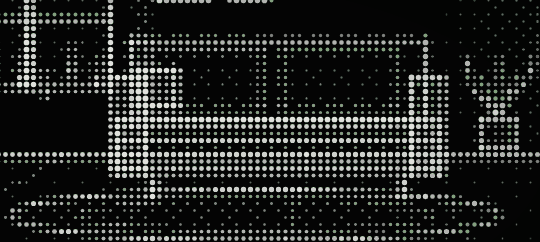

# terminal

Terminal-style personal site with a dot-matrix living room and an animated pixel mascot.



Static — no dependencies, no bundler. One optional Node script regenerates the
static HTML from the content file.

```
index.html    layout + the pre-opened terminal blocks (content generated by build.js)
styles.css    theme (green on near-black, monospace)
data.js       ALL the content + the HTML renderers — the single source of truth
script.js     interactive terminal (commands, history, completion)
scene.js      dot-matrix room renderer + pixel mascot animation
build.js      injects data.js into index.html so the site works without JavaScript
```

## Run locally

```bash
python3 -m http.server 8000   # then open http://localhost:8000
```

## Editing content

Edit `data.js` — projects, stack, links, about, help, resume — then:

```bash
node build.js     # rewrites the static blocks inside index.html
```

Skipping the build isn't fatal: `script.js` fills any block it finds empty, so the
page still looks right with JavaScript on. But the static copy in `index.html` is
what crawlers and no-JS visitors see, so it must be regenerated to stay in sync.

A project without a `u` field renders as a plain card instead of a link.

## Works without JavaScript

`index.html` ships the real content in the markup. With JS off, the scene panel, the
prompt and the shortcut buttons hide themselves (they'd be dead weight) and the page
reads as a plain document. The `js` class on `<html>`, set by an inline script in
`<head>`, is what switches the interactive parts on.

## Favicon

Inline SVG data URI in `index.html` — the mascot's head redrawn as an 11-rect pixel
sprite at 16×16, `shape-rendering='crispEdges'`. No file to serve, same palette as
`scene.js`.

## Terminal commands

`help about projects skills contact resume ls cat <file> whoami echo date sudo clear`
plus mascot actions `coffee` `wave` `sleep`.
Tab completes, ↑/↓ walks history, Ctrl-L clears, Ctrl-U wipes the line.

## Deploy (GitHub Pages)

Run `node build.js`, push, then Settings → Pages → source `main` / root.

## The scene

`scene.js` paints the room into a low-resolution offscreen canvas (1 pixel = 1 dot),
then converts each pixel to a dot whose size and opacity follow its brightness, with
Bayer dithering for the mid-tones. Room geometry is normalized (0..1), so it scales
with the panel. The mascot is drawn on a second canvas from a 44×36 virtual pixel
grid — silhouette spans give the outline for free — and animates at display rate
(breathing, blinking, steam, sip/wave/sleep actions). On load she walks in from the
left and sits down. `COUCH` drives both the sofa drawing and where the mascot sits,
so moving one moves the other.

**The choreography.** `scene.js` drives the mascot with an **action queue** rather than a
state machine that grows a `case` per behaviour: a scenario is a plain array of steps
(`walk`, `jump`, `wait`, `wipe`, `carry`, `hud`, …) executed in order, each handler
returning `true` when it's done. Adding a behaviour means adding an entry, not a branch.

- **Arrival** — she walks in from off-frame left, then **jumps** onto the couch: a short
  crouch, a parabolic arc overshooting the seat, and a settle bounce on landing.
- **Sipping** (`coffee`) — she lifts the mug from her lap to her muzzle, tilts it, drinks
  with her eyes half-lidded and her throat gulping, then lowers it and looks pleased. The
  coffee level drops a little with every sip and only refills when she fetches a fresh cup.
- **Drowsiness** — after `DROWSY_AT` seconds seated without interaction (20s) the eyelids
  drop, blinks slow down, yawns kick in, breathing slows. At `SLEEP_AT` (40s) she falls
  asleep across three drawn poses — seated → slumped → flat (`SIL_SIT` / `SIL_SLUMP` /
  `SIL_LIE`), no sprite rotation, so every frame stays pixel-crisp. The mug slips from her paw
  with a first spray of droplets, tumbles through a full spin plus a quarter — so it lands
  exactly on its side, matching the tipped sprite with no visual jump — bounces once,
  splashes on impact, and the coffee spreads into a puddle.
- **Waking** — she opens her eyes still lying down, sits back up and stretches. *Then* she
  spots the spilled mug: a short beat with a `!` over her head (`oh no. the coffee.`). Only
  after that does she walk **off-frame**, come back **carrying a rag**, wipe
  the stain until it's gone, leaves again with the dirty mug, returns with a **fresh cup**,
  and jumps back onto the couch. Any keypress, click or command triggers it, mid-`sleep`
  included.

The mascot's outline is dark green (`PAL.D`); the mug and puddle use their own neutral
colours (`PAL.O` ceramic, `PAL.P` stain edge) so the crockery doesn't inherit a green rim.
The spill is drawn *before* the mascot so the rag passes over the stain, not under it.

`SIL_SLUMP` comes from `silFromBlobs()`, which rasterizes a few ellipses into spans —
easier to tweak than hand-typed pixel rows: move a `{cx, cy, rx, ry}` and the outline
follows.

**Cost control.** The room is painted once and cached; only the sprite layer redraws.
Nothing is painted while the mascot is off-frame (her backstage trips are free), and an
`IntersectionObserver` stops painting altogether when the panel is scrolled out of view —
the animation keeps advancing, so it's up to date when it comes back.
